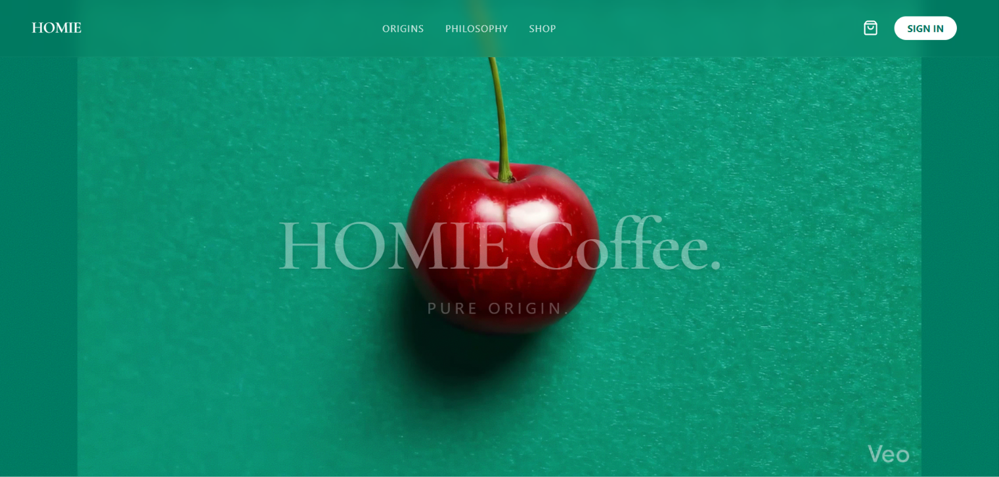

<div align="center">
  

  <h1>☕ Homie Coffee</h1>
  <p><b>An Awwwards-Style, Premium Web Experience</b></p>
  
  <p>
    <a href="https://homie-coffeeeee.vercel.app/"><strong>View Live Demo</strong></a> · 
    <a href="#-features"><strong>Explore Features</strong></a>
  </p>

  <p>
    
    
    
    
    
  </p>
</div>

<br>

## 🌟 Overview

**Homie Coffee** is a high-performance, immersive web application designed with a deep focus on premium UI/UX and visual storytelling. Inspired by award-winning websites, it combines buttery-smooth animations, advanced parallax scrolling, and a modern minimal design language to create a memorable "Pure Origin" user journey.

It aims to provide users with an engaging and visually stunning digital coffee shop experience, setting a new standard for modern web design.

---

## ✨ Features

- 🎭 **Immersive Animations:** Fluid and cinematic micro-interactions powered by GSAP and Framer Motion.
- 📱 **Responsive Design:** A fully adaptive layout that looks stunning on desktops, tablets, and mobile devices.
- ⚡ **High Performance:** Optimized for speed with Next.js Server-Side Rendering (SSR) and Static Site Generation (SSG).
- 🎨 **Modern UI/UX:** Clean, minimal, and Awwwards-inspired aesthetics with glassmorphism and subtle shadows.
- 🗄️ **Seamless Backend Integration:** Real-time data handling and authentication powered by Supabase.

---

## 🛠️ Installation & Getting Started

To run the project locally on your machine, follow these steps:

### Prerequisites
Make sure you have **Node.js** (v18+) and **npm/yarn/pnpm** installed.

### 1. Clone the repository
```bash
git clone https://github.com/RonitkumarSoni/Homie-coffee.git
cd Homie-coffee
```

### 2. Install dependencies
```bash
npm install
# or
yarn install
# or
pnpm install
```

### 3. Setup Environment Variables
Create a `.env.local` file in the root directory and add your Supabase credentials:
```env
NEXT_PUBLIC_SUPABASE_URL=your_supabase_url
NEXT_PUBLIC_SUPABASE_ANON_KEY=your_supabase_anon_key
```

### 4. Run the development server
```bash
npm run dev
# or
yarn dev
```
Open [http://localhost:3000](http://localhost:3000) in your browser to see the result.

---

## 💡 Architecture & Design

Homie Coffee follows a modular component-based architecture:
- **Frontend:** Built with Next.js (App Router) for robust routing and SEO optimization.
- **Styling:** Tailwind CSS is used for rapid, utility-first styling, ensuring consistency across the application.
- **Animations:** A hybrid approach using GSAP for complex scroll-triggered animations and Framer Motion for component-level transitions.
- **Database:** Supabase serves as the backend-as-a-service, handling user data and authentications seamlessly.

---

## 🤝 Contributing

Contributions, issues, and feature requests are welcome! 
Feel free to check out the [issues page](https://github.com/RonitkumarSoni/Homie-coffee/issues).

1. Fork the project.
2. Create your feature branch (`git checkout -b feature/AmazingFeature`).
3. Commit your changes (`git commit -m 'Add some AmazingFeature'`).
4. Push to the branch (`git push origin feature/AmazingFeature`).
5. Open a Pull Request.

---

## 📜 License

Distributed under the MIT License. See `LICENSE` for more information.

<div align="center">
  <sub>Built with ❤️ by <a href="https://github.com/RonitkumarSoni">Ronit Kumar Soni</a></sub>
</div>
